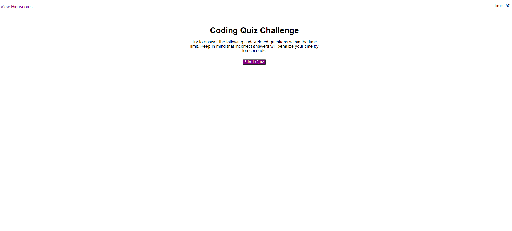
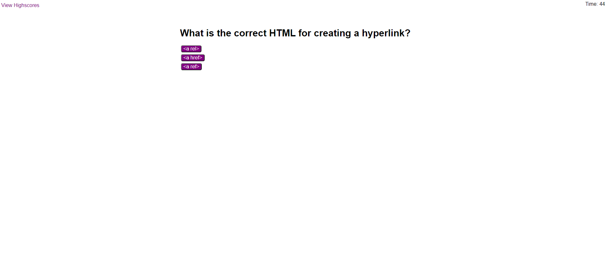
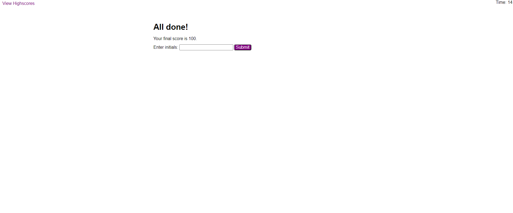
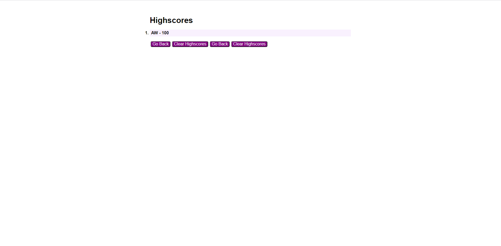

# CodeQuiz

## Description

We were tasked with creating a JavaScript code quiz. It was a good exercise to stretch our understanding of JavaScript and how it affects HTML, and also to put into practice things we've learned through the week.

Quizzes are a good test of timers, editing HTML, and storing to local storage. Personally, I had a struggle getting a for loop to create my buttons at first, but I managed to eventually get it to work. It wasn't computing the array length semantics I was trying to use in it, although unfortunately I don't recall exactly what change I made to get it to behave.

I did my best to make the quiz visually and functionally the same as the gif example we were provided. I wanted to make sure I could use CSS and changing elements in JavaScript to get the end result I was looking for.

[Deployed Website](https://ashleyaggie.github.io/CodeQuiz/)

## Changes Made

## Credits

Website code was written by myself (Ashley Wright)

Assignment is part of the SMU Coding Boot Camp

## License

Copyright (c) 2021 Ashley Wright

Covered by the [GNU General Public License v3.0](https://choosealicense.com/licenses/gpl-3.0/)